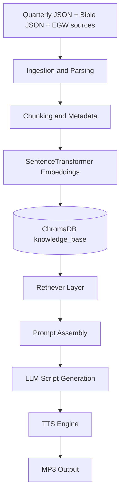

# Quarterly Companion

Quarterly Companion is a Retrieval-Augmented Generation (RAG) project for daily Sabbath School study and devotional audio generation. It is designed to ingest Sabbath School lesson content, Bible text, and Ellen G. White (EGW) writings, then synthesize those sources into rich study output and podcast-ready narration.

## Vision

This system takes Sabbath School lesson text, dynamically pulls corresponding Scripture verses and EGW writings, generates a theological synthesis, and optionally converts that synthesis into downloadable audio.

## Core 4-Step Pipeline

1. **Ingest and Chunk**
	- Parse Sabbath School Quarterly content by year, quarter, lesson, and day.
	- Parse Bible translations and EGW books.
	- Normalize and chunk documents, then embed into ChromaDB.

2. **Retrieve Context**
	- When a user selects a lesson day, retrieve the daily lesson context from vectors.
	- Retrieve linked Bible references.
	- Retrieve EGW passages semantically aligned to the lesson themes.

3. **Harmonize and Generate Script**
	- Send retrieved context into a structured LLM prompt.
	- Generate either:
	  - a detailed lesson synthesis, or
	  - a dual-host conversational podcast script.

4. **Synthesize Audio**
	- Stream generated script text into a TTS backend (for example, OpenAI Audio or ElevenLabs).
	- Return an MP3 audio file suitable for mobile listening or sharing.

## Current Implementation Status

This repository is currently in an early build phase.

Implemented now:
- Quarterly JSON ingestion pipeline (load -> parse -> embed) under `src/ingestion/quarterly`.
- Bible ingestion parser/chunker/embedder scaffold under `src/ingestion/bible`.
- ChromaDB persistence in `data/chromadb`.
- Initial OpenAI TTS integration in `src/services/tts.py`.
- Initial podcast prompt builder in `src/services/script_generator.py`.
- A draft audio route in `src/api/routes/audio.py`.

Partially implemented or scaffold only:
- Retrieval layer (`src/retrieval`) files are present but mostly empty.
- LLM orchestration layer (`src/llm`) files are present but mostly empty.
- API composition (`src/api/api.py`, several route files) is not wired.
- EGW parsing/embedding pipeline is not complete.

## High-Level Architecture



## Folder Structure

```text
quarterlycompanion/
|-- main.py
|-- pyproject.toml
|-- requirements.txt
|-- README.md
|-- data/
|   |-- chromadb/
|   |   |-- chroma.sqlite3
|   |   |-- <collection directories>
|   |-- processed/
|   |-- indexes/
|   |-- raw/
|       |-- bible/
|       |   |-- asv.json
|       |   |-- kjv.json
|       |   `-- webster.json
|       |-- commentary/
|       |-- egw/
|       `-- quarterly/
|           |-- 2026/
|           |   |-- Q1/
|           |   |-- Q2/
|           |   |-- Q3/
|           |   `-- Q4/
|           `-- 2026-03/
|               |-- quarter.json
|               |-- 01/ ... 13/
|               |   |-- lesson.json
|               |   |-- teacher-comments.json
|               |   |-- inside-story.json
|               |   |-- hope-ss.json
|               |   `-- daily files (01.json ... 07.json)
|-- models/
|-- scripts/
`-- src/
	 |-- __init__.py
	 |-- config.py
	 |-- api/
	 |   |-- __init__.py
	 |   |-- api.py
	 |   `-- routes/
	 |       |-- audio.py
	 |       |-- chat.py
	 |       |-- lesson.py
	 |       `-- search.py
	 |-- ingestion/
	 |   |-- bible/
	 |   |   |-- chunker.py
	 |   |   |-- embedder.py
	 |   |   |-- ingest_script.py
	 |   |   |-- loader.py
	 |   |   `-- parser.py
	 |   |-- commentary/
	 |   |   `-- parser.py
	 |   |-- egw/
	 |   |   |-- parser.py
	 |   |   `-- scraper.py
	 |   `-- quarterly/
	 |       |-- chunker.py
	 |       |-- clean_html.py
	 |       |-- downloader.py
	 |       |-- embedder.py
	 |       |-- extractor.py
	 |       |-- ingest.py
	 |       |-- loader.py
	 |       `-- parser.py
	 |-- llm/
	 |   |-- assistant.py
	 |   |-- client.py
	 |   `-- prompt.py
	 |-- retrieval/
	 |   |-- bm25.py
	 |   |-- hybrid_search.py
	 |   |-- reranker.py
	 |   |-- retriever.py
	 |   `-- vector_search.py
	 |-- services/
	 |   |-- lesson_service.py
	 |   |-- podcast.py
	 |   |-- script_generator.py
	 |   |-- scripture.py
	 |   `-- tts.py
	 `-- utils/
		  |-- metadata.py
		  `-- references.py
```

## Data Sources

- **Quarterly content**: Daily lesson JSON and supporting lesson assets.
- **Bible texts**: Translation JSON files in `data/raw/bible`.
- **EGW content**: Scraped/parsing pipeline under `src/ingestion/egw`.

## Metadata Strategy

Current ingestion writes metadata fields such as:
- `doc_type` (for example, `lesson` or `bible`)
- `quarter_id`, `quarter_title`
- `lesson`, `lesson_title`
- `day`, `day_title`, `date`
- `translation`, `reference` (for Bible snippets)

This metadata is intended to support precise filtering and hybrid retrieval later.

## Tech Stack

- **Language**: Python 3.13+
- **Vector DB**: ChromaDB
- **Embeddings**: Sentence Transformers (`BAAI/bge-small-en-v1.5`, `all-MiniLM-L6-v2`)
- **API**: FastAPI + Uvicorn
- **LLM/TTS client**: OpenAI SDK
- **Parsing**: BeautifulSoup, markdownify, lxml
- **Planned retrieval**: BM25 + vector + reranking

## Setup

### 1. Create and activate environment

Windows PowerShell:

```powershell
python -m venv .venv
.\.venv\Scripts\Activate.ps1
```

### 2. Install dependencies

```powershell
pip install -r requirements.txt
```

Or with project metadata:

```powershell
pip install -e .
```

### 3. Configure environment variables

Create a `.env` file in project root (or set env vars in your shell):

```env
OPENAI_API_KEY=your_openai_api_key
```

Optional future variables (recommended convention):

```env
CHROMA_DB_PATH=./data/chromadb
EMBEDDING_MODEL=BAAI/bge-small-en-v1.5
OPENAI_CHAT_MODEL=gpt-4.1-mini
OPENAI_TTS_MODEL=tts-1-hd
OPENAI_TTS_VOICE=alloy
```

## Running Ingestion

### Quarterly ingestion

```powershell
python -m src.ingestion.quarterly.ingest
```

What it does now:
- Iterates all quarterly JSON files under `data/raw/quarterly`.
- Skips non-daily documents.
- Parses lesson body and embedded Bible references.
- Generates embeddings and upserts to Chroma collection `knowledge_base`.

### Bible ingestion

```powershell
python -m src.ingestion.bible.ingest_script
```

Note: this path currently needs refactoring to align loader/parser function contracts before reliable execution.

## API and Audio Flow

Draft route exists at `src/api/routes/audio.py`:
- Endpoint: `POST /audio/generate`
- Payload:

```json
{
  "year": 2026,
  "quarter": 2,
  "lesson_num": 3,
  "day_of_week": "Tuesday"
}
```

Intended flow:
1. Retrieve daily context from vector store.
2. Generate script from quarterly + Bible + EGW content.
3. Convert script to MP3 bytes with TTS.
4. Stream MP3 as downloadable response.

Current state: route has placeholder imports and unresolved function bindings, so it should be treated as design scaffold until retrieval/service wiring is completed.

## Development Workflow

### Format and lint

```powershell
black .
ruff check .
```

### Tests

```powershell
pytest
```

## Known Gaps and TODOs

1. Wire `src/api/api.py` into a runnable FastAPI application entrypoint.
2. Complete retriever implementation in `src/retrieval`.
3. Implement EGW parsing/chunking/embedding pipeline.
4. Unify embedding model strategy and document prefixes across ingestion pipelines.
5. Resolve Bible ingestion contract mismatch (`load_bibles` usage).
6. Add robust logging, retries, and idempotent ingestion checks.
7. Add tests for ingestion correctness and retrieval relevance.
8. Add configurable prompt templates for study mode vs podcast mode.
9. Support dual-host podcast script generation mode.
10. Add optional non-OpenAI TTS provider abstraction.

## Suggested Next Milestone

Milestone goal: end-to-end day-level prototype.

Definition of done:
- User selects year/quarter/lesson/day.
- System returns synthesized markdown devotional.
- Same content can be rendered to MP3 and downloaded.
- Retrieval traces show which lesson/Bible/EGW chunks were used.

## Contribution Notes

- Keep ingestion deterministic and metadata-rich.
- Prefer explicit metadata filters over broad semantic retrieval alone.
- Add tests whenever parser/extractor logic changes.
- Preserve theological source traceability in generated output.

## Disclaimer

This project is for study and educational workflow development. Verify doctrinal conclusions and references against primary sources.

## License

No license file is currently present in this repository. Add a `LICENSE` file to define usage terms.
